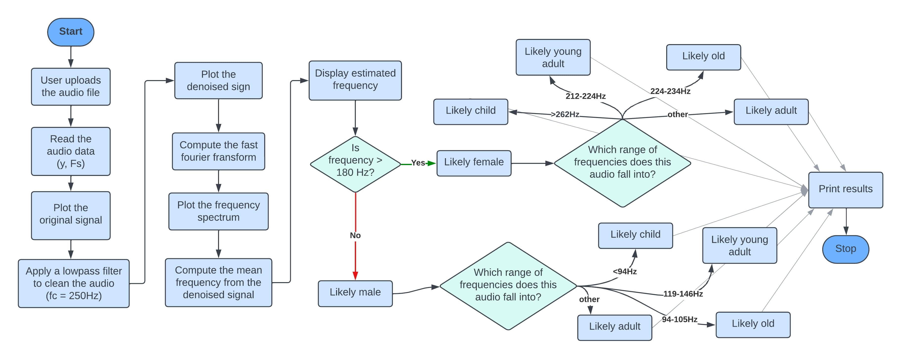

## Speech Analyzer

The Speech Analyzer is a MATLAB-based program designed for comprehensive speech analysis
Using signal processing techniques, our analyzer estimates a speaker’s gender and age from audio signals
Offers real-time analysis for informed decision-making and safer digital interactions
Can be used in market research, customer service, security, and in various other sectors
Includes a user-friendly graphical interface, which makes it accessible and easy to use

This is a workflow diagram of how The Speech Analyzer works:

